# Meditations system architecture

This document explains what the application is intended to do, how its offline data pipeline and
runtime chat pipeline fit together, and why the major implementation choices were made. It is the
recommended starting point for developers working in this repository. Detailed decision logs for
individual subsystems are linked at the end.

## Purpose and behavioral contract

Meditations is a reflective Angular application whose Journal offers conversational guidance
grounded in the George Long translation of Marcus Aurelius's _Meditations_. It is designed to do
four things well:

1. Build a reproducible, traceable search corpus from a fixed set of English Wikisource pages.
2. Decide whether a user message is safe and appropriate for this corpus before performing
   retrieval.
3. Answer allowed messages using retrieved passages, while showing the exact source text and a
   link back to Wikisource.
4. Recognize requests to schedule meditation and present an editable, explicit confirmation before
   creating a Cal.com booking.

The chat is a reflective companion, not a general-purpose assistant and not a replacement for
medical, legal, financial, emergency, or other professional help. It must not invent Marcus
Aurelius's views when the supplied edition does not support an answer.

The core response contract is:

- Only an `IN_SCOPE` message may be embedded or sent to Pinecone.
- A supported answer must cite at least one retrieved canonical section.
- Every displayed quotation is copied from the retrieved `chunk_text`; it is not generated by the
  answer model.
- A quotation is displayed only after the backend confirms it is an exact substring of its
  canonical parent section.
- If evidence is insufficient, the server returns a fixed abstention with no citations.
- Safety, out-of-scope, reframe, and clarification responses never include retrieved passages.
- A `SCHEDULE` response never retrieves, and a proposal never books anything until the user presses
  the confirmation button with the displayed date, time, timezone, name, and email.

In the interface, italics mean “verbatim text retrieved from the configured George Long corpus.”
They do not mean that every philosophical assertion in the passage is an objectively true claim.

## System at a glance

The project contains an offline pipeline and a runtime pipeline. They meet at the Pinecone
namespace but otherwise run independently.

```mermaid
flowchart LR
  subgraph Offline["Offline corpus pipeline"]
    URLs["12 Wikisource URLs"] --> Ingest["MediaWiki ingestion"]
    Ingest --> Parents["487 canonical parents"]
    Parents --> Chunker["Parent-aware chunker"]
    Chunker --> Children["557 searchable children"]
    Parents --> Upload["Validated uploader"]
    Children --> Upload
    Upload --> EmbedCorpus["OpenAI embeddings"]
    EmbedCorpus --> Pinecone[("Pinecone namespace")]
  end

  subgraph Runtime["Local runtime chat pipeline"]
    User["Angular Journal"] --> API["Loopback Node API"]
    API --> Router["Safety and scope router"]
    Router -->|"IN_SCOPE only"| EmbedQuery["OpenAI query embedding"]
    Router -->|"SCHEDULE only"| Proposal["Scheduling extractor + confirmation proposal"]
    Proposal --> Confirm["User confirms exact details"]
    Confirm --> Cal["Cal.com booking API"]
    EmbedQuery --> Pinecone
    Pinecone --> Evidence["Child match + canonical parent"]
    Evidence --> Answer["Grounded answer model"]
    Answer --> API
    API --> User
  end
```



The complete parent section is the canonical document. Children are smaller search units. A child
may contain text from exactly one parent, and a child match brings its complete parent text back as
generation context.

## Offline corpus pipeline

### 1. Source manifest

[`data/sources/meditations-wiki-urls-georgelang.txt`](../data/sources/meditations-wiki-urls-georgelang.txt)
is the source-of-truth list for Books I–XII. The ingestion command validates that the file contains
exactly one HTTPS English Wikisource URL for every book before making a request.

The URL list is data rather than code so the source edition is visible, reviewable, and replaceable
without editing the parser.

### 2. MediaWiki ingestion

[`scripts/ingest-meditations.ts`](../scripts/ingest-meditations.ts) calls MediaWiki's `action=parse`
endpoint for each book. MediaWiki performs wikitext and template rendering; the local parser then
extracts canonical section text and removes navigation and footnotes.

The parser creates one parent per numbered Meditations section. Each parent contains:

- a deterministic edition-specific ID;
- a human-readable canonical reference such as `8.36`;
- the complete display/search text;
- book, section, translator, edition, and year metadata;
- a SHA-256 content hash; and
- Wikisource page, page ID, and revision provenance.

The current George Long source is locked to the observed count of 487 sections. An unexpected
section count or sequence aborts the run because silently accepting a partial book would produce a
plausible but corrupt corpus.

### 3. Parent/child chunking

The pure TypeScript chunker in [`src/app/core/chunking`](../src/app/core/chunking) converts each
canonical parent into one or more retrieval children. It never fetches data, embeds text, performs
search, or calls a model.

The default adaptive policy is:

| Parent size          | Primary structure          | Preferred child size         |
| -------------------- | -------------------------- | ---------------------------- |
| Up to 180 tokens     | Whole parent               | One complete child           |
| 181–400 tokens       | Sentences                  | Approximately 120–180 tokens |
| More than 400 tokens | Paragraphs, then sentences | Approximately 150–220 tokens |

Every child has a hard maximum of 260 tokens. When a structural unit is too large, fallback order
is sentence, semicolon, colon, em dash, and finally a Unicode-safe token split. The algorithm always
preserves reading order and never crosses a parent boundary.

Limited semantic overlap can repeat the preceding complete sentence in the next child. Overlap is
bounded to 80 tokens and less than 40 percent of the resulting child. It is removed when it would
violate the hard maximum or produce a near-duplicate.

Children retain inclusive-start/exclusive-end UTF-16 offsets into `parent.text_search`. Therefore:

```ts
parent.text_search.slice(child.start_char, child.end_char) === child.text_search;
```

The exact source slice, stable ID, sequential index, offsets, size, coverage, overlap, and parent
identity are validated before a result is returned. With the same parent text, configuration,
tokenizer, and chunking version, the output is deterministic.

### 4. Generated artifacts

Ingestion and chunking write three artifacts under `data/generated`:

```text
meditations-long-1862.parents.jsonl
meditations-long-1862.children.jsonl
meditations-long-1862.manifest.json
```

The manifest records the edition, MediaWiki revision IDs, tokenizer, chunking version and
configuration, record counts, and SHA-256 hashes of both JSONL files. Files are written to temporary
siblings and renamed only after a complete successful run, so a failed refresh does not replace the
last valid dataset.

### 5. Embedding and Pinecone upload

[`scripts/pinecone.ts`](../scripts/pinecone.ts) validates the generated manifest and JSONL hashes,
joins every child to its parent, and creates Pinecone records. Each vector record includes both:

- `chunk_text`, which is embedded and used for semantic matching; and
- `parent_text`, which is returned after a match and supplied to answer generation.

This intentionally duplicates parent text in child metadata. The corpus is small, and the tradeoff
eliminates a second database lookup during chat while retaining the parent/child retrieval design.

For the currently used standard index, OpenAI `text-embedding-3-small` produces 1536-dimensional
vectors. Embedding batches contain at most 96 texts; Pinecone vector batches contain 20 records to
stay below the request-size limit. The uploader records the embedding model and dimensions in each
record's metadata so runtime queries can reject a mismatched corpus.

The uploader also supports Pinecone integrated-embedding indexes whose text field is mapped to
`chunk_text`. The current terminal query and localhost chat paths deliberately require a standard
1536-dimensional dense index because they create query vectors with OpenAI themselves.

After upload, verification waits for eventual consistency, requires the namespace count to equal
the local child count, and fetches representative first, middle, and final records. It never deletes
unexpected remote records automatically.

## Runtime chat pipeline

```mermaid
sequenceDiagram
  actor User
  participant Angular as Angular Journal
  participant API as Local Node API
  participant Rules as Deterministic safety rules
  participant Moderation as OpenAI moderation
  participant Classifier as Scope classifier
  participant Extractor as Schedule extractor
  participant Cal as Cal.com
  participant Embeddings as OpenAI embeddings
  participant Pinecone
  participant Answer as Grounded answer model

  User->>Angular: Submit a message
  Angular->>API: POST /api/chat with bounded history
  API->>Rules: Check high-signal safety and input cases
  Rules-->>API: Return immediately when matched
  API->>Moderation: Moderate remaining messages
  Moderation-->>API: Safety categories
  API->>Classifier: Choose one of six routes
  Classifier-->>API: Structured route decision
  alt Route is SCHEDULE
    API->>Extractor: Resolve conversational date and time
    Extractor-->>API: Structured proposal or clarification
    API-->>Angular: Editable proposal; no booking yet
    User->>Angular: Confirm exact details
    Angular->>API: POST /api/schedule
    API->>Cal: Create booking once
    Cal-->>API: Confirmed booking or bounded failure
    API-->>Angular: Booking result
  else Route is not IN_SCOPE
    API-->>Angular: Fixed/bounded response, no citations
  else Route is IN_SCOPE
    API->>Embeddings: Create 1536-dimensional query vector
    Embeddings-->>API: Query vector
    API->>Pinecone: Top-5 vector query
    Pinecone-->>API: Child matches and parent metadata
    API->>Answer: Message, history, and up to 4 unique parents
    Answer-->>API: Structured answer and selected references
    API-->>Angular: Answer plus exact child quotes and URLs
  end
```

### Browser and local state

The Angular application uses standalone, lazy-loaded components and signal-based stores. The four
routes are Journal, Reflections, Library, and Profile. The Journal is the only route connected to
the AI backend.

`ChatStore` owns the displayed conversation, chat and booking request state, pending scheduling
proposal, reset behavior, and bounded history sent to the server. It persists conversation messages
in browser `localStorage` under the versioned key `meditations.conversation.v3`; attendee name and
email are not persisted. A reset increments a request generation number so an older slow chat
response cannot appear in a newly reset conversation, and reset is disabled during a booking.

`ChatApiClient` sends requests to same-origin `/api/chat` and confirmed proposals to
`/api/schedule`. It treats both responses as untrusted at runtime and validates route/reason,
message, citations, scheduling fields, booking identity, duration, and UTC start before storing or
rendering anything.

The message component displays generated prose in the normal chat bubble. Each selected source is
rendered separately as a semantic `<blockquote><em>…</em></blockquote>` followed by its canonical
reference link. Angular interpolation provides output escaping, while URL allowlisting limits links
to HTTPS pages under `en.wikisource.org/wiki/`.

### Local API boundary

[`scripts/chat-api.ts`](../scripts/chat-api.ts) is a minimal Node HTTP server. It loads server-side
credentials from `.env`, validates the Pinecone index at startup, and binds only to `127.0.0.1` or
`localhost`. Angular's development proxy forwards `/api` to port 3000.

The endpoint contract is:

```http
POST /api/chat
Content-Type: application/json
```

```json
{
  "message": "I am anxious about tomorrow.",
  "history": [
    {
      "author": "marcus",
      "content": "What troubles your mind today?"
    }
  ],
  "timezone": "America/New_York"
}
```

A successful in-scope response has this shape:

```json
{
  "route": "IN_SCOPE",
  "reason": "PERSONAL_REFLECTION",
  "message": "Generated guidance grounded in a cited section.",
  "citations": [
    {
      "canonicalRef": "8.36",
      "quote": "Exact child text retrieved from Pinecone.",
      "sourceUrl": "https://en.wikisource.org/wiki/..."
    }
  ],
  "schedulingProposal": null
}
```

A scheduling response uses `route: "SCHEDULE"`, contains no citations, and either returns a short
clarification with `schedulingProposal: null` or a proposal with a one-time ID, suggested local
date/time, IANA timezone, and event duration. Confirming that proposal uses `POST /api/schedule`.
Only that second endpoint calls Cal.com.

Requests are limited to a 32 KiB body, a 600-character current message, and eight history messages
of at most 2,400 characters each. The server permits six concurrent chat requests, sets
`Cache-Control: no-store`, rejects unexpected browser origins, and returns generic server errors
instead of provider response bodies or credentials.

This API is intentionally local-development infrastructure. It has no authentication, user-level
rate limiting, durable storage, or production deployment hardening.

### Safety and scope routing

The `ConversationRouter` is the only gateway to embeddings and retrieval. It produces exactly six
routes:

| Route                 | Retrieval | Intended behavior                                                                  |
| --------------------- | --------- | ---------------------------------------------------------------------------------- |
| `IN_SCOPE`            | Yes       | Reflect on a personal situation or answer a corpus question.                       |
| `SCHEDULE`            | No        | Prepare a meditation-time proposal for explicit calendar confirmation.             |
| `REFRAME`             | No        | Offer one bounded Meditations-oriented reformulation for the user to choose.       |
| `OUT_OF_SCOPE`        | No        | Decline unrelated tasks, external facts, prompt injection, or professional advice. |
| `NEEDS_CLARIFICATION` | No        | Ask for clarity when intent, safety, or meaning is uncertain.                      |
| `SAFETY`              | No        | Return a fixed safety-oriented response without philosophical retrieval.           |

Routing order is significant:

1. Deterministic high-signal rules catch known self-harm, violence, abuse, eating-distress,
   reality-distress, empty, overlong, nonsense, and ambiguous physical-need cases.
2. OpenAI moderation checks messages not handled by the first pass.
3. A structured-output scope classifier handles the remaining semantic decision.

Safety has priority over philosophical relevance. Moderation or classifier failure produces
`NEEDS_CLARIFICATION` and prevents retrieval. This fail-closed behavior favors a temporary non-answer
over bypassing a safety boundary.

`REFRAME` never silently searches rewritten text. It proposes a reflective question and waits for
the user to submit it, keeping the scope transition visible.

### Retrieval and evidence assembly

For `IN_SCOPE` messages, `MeditationsChatService`:

1. embeds the user's current message with the configured 1536-dimensional embedding model;
2. retrieves the top five Pinecone children;
3. checks each result's embedding model and dimension metadata;
4. deduplicates results by `parent_id` and keeps at most four unique parents;
5. validates required reference, parent text, child text, and trusted source URL metadata; and
6. requires `parent_text.includes(chunk_text)` before passing evidence to generation.

The child enables precise semantic search and supplies the exact displayed quotation. The parent
supplies complete canonical context to the answer model. This avoids generating from an isolated
sentence while preventing a large section from weakening vector-search precision.

### Grounded answer generation

The answer client uses the OpenAI Responses API. Its default model is `gpt-5.6-sol` with low
reasoning effort; the route classifier defaults to the lower-latency `gpt-5.6-luna` with no
reasoning effort. These roles are configured independently because classification and grounded
prose have different complexity and latency needs.

The model receives the current message, bounded conversation history, and complete retrieved parent
texts. A strict JSON schema requires:

- `sufficient_evidence`;
- `answer`; and
- `cited_references`, constrained to references that were actually supplied in that request.

Application validation rejects malformed output, unsupported references, empty supported answers,
citations on unsupported answers, and oversized prose. The model is instructed to paraphrase its
own answer because exact quotations are attached separately by trusted application code.

If `sufficient_evidence` is false, the model's draft is discarded and the application returns a
fixed abstention. This makes “the question is about Meditations” distinct from “the retrieved
edition supports a reliable answer.”

## Code organization and responsibilities

```text
scripts/
├── dev.ts                    Starts the Angular and API development processes
├── ingest-meditations.ts     Fetches, parses, validates, and chunks Wikisource data
├── pinecone.ts               Uploads and verifies corpus records
├── query-meditations.ts      Routes and tests raw retrieval from the terminal
├── test-routing.ts           Runs the live routing regression suite
└── chat-api.ts               Exposes the loopback chat HTTP API

src/app/
├── core/
│   ├── chat/                 Retrieval orchestration and grounded generation
│   ├── chunking/             Pure deterministic parent/child chunking
│   ├── ingestion/            Source-manifest and MediaWiki DOM parsing
│   ├── models/               Browser/API message contracts
│   ├── observability/        Correlated pipeline and decision logging
│   ├── pinecone/             Embedding, record, and Pinecone REST clients
│   ├── routing/              Safety policy, moderation, and scope classification
│   ├── scheduling/           Date/time extraction, proposal registry, and Cal.com adapter
│   └── services/             Angular chat, API, and preference stores
├── features/                 Lazy-loaded Journal, Reflections, Library, and Profile screens
└── shared/                   Chat composer, message rendering, and reusable icons
```

The `core/chunking`, `core/ingestion`, `core/pinecone`, `core/routing`, and `core/chat` modules do not
depend on Angular UI APIs. This lets Node scripts reuse the same contracts and validation logic that
are covered by the project test suite.

## Configuration and secrets

Copy [`.env.example`](../.env.example) to `.env` and provide the required values. Secrets belong
only in the Node process; they must never be added to Angular environment files or browser code.

| Variable                  | Required                                       | Purpose                                               |
| ------------------------- | ---------------------------------------------- | ----------------------------------------------------- |
| `OPENAI_API_KEY`          | Yes for standard-index upload, query, and chat | Moderation, routing, embeddings, and answers          |
| `PINECONE_API_KEY`        | Yes                                            | Pinecone control/data API authentication              |
| `PINECONE_INDEX`          | Yes                                            | Index identity used during safety preflight           |
| `PINECONE_INDEX_HOST`     | Yes                                            | Exact data-plane host for the same index              |
| `PINECONE_NAMESPACE`      | No                                             | Defaults to `long-1862`                               |
| `OPENAI_EMBEDDING_MODEL`  | No                                             | Defaults to `text-embedding-3-small`                  |
| `OPENAI_ROUTER_MODEL`     | No                                             | Defaults to `gpt-5.6-luna`                            |
| `OPENAI_MODERATION_MODEL` | No                                             | Defaults to `omni-moderation-latest`                  |
| `OPENAI_CHAT_MODEL`       | No                                             | Defaults to `gpt-5.6-sol`                             |
| `CAL_API_KEY`             | Yes for localhost chat                         | Server-side Cal.com bearer credential                 |
| `CAL_EVENT_TYPE_ID`       | Yes for localhost chat                         | Numeric meditation event type                         |
| `OPENAI_BASE_URL`         | No                                             | Defaults to `https://api.openai.com/v1`               |
| `MEDITATIONS_API_HOST`    | No                                             | Loopback only; defaults to `127.0.0.1`                |
| `MEDITATIONS_API_PORT`    | No                                             | Defaults to `3000`                                    |
| `DATABASE_URL`            | No                                             | Not used by ingestion, retrieval, chat, or scheduling |

Startup validates that `PINECONE_INDEX` and `PINECONE_INDEX_HOST` describe the same ready index.
The runtime chat additionally requires a standard dense index with 1536 dimensions.

## Operational commands

Install dependencies and run the local application:

```bash
nvm use
npm install
npm start
```

`npm start` supervises both the Angular development server and the watch-mode API. The application
is available at `http://localhost:4200`; the API health endpoint is
`http://127.0.0.1:3000/api/health`.

Regenerate the corpus from Wikisource:

```bash
npm run ingest:meditations
```

Validate locally without contacting Pinecone, then upload and verify:

```bash
npm run pinecone:upsert -- --dry-run
npm run pinecone:upsert
npm run pinecone:verify
```

Exercise routing and retrieval from the terminal:

```bash
npm run pinecone:query -- "I'm anxious about tomorrow"
npm run pinecone:query:test
npm run routing:test
```

Run the deterministic test suite and production build:

```bash
npm test -- --watch=false
npm run build
```

## Major coding decisions and rationale

1. **Canonical sections are parents.** Section boundaries have textual and citation meaning. Search
   optimization is allowed only inside a section, never across `1.7` and `1.8`.

2. **Search children and generation parents serve different jobs.** Small children improve vector
   precision; complete parents prevent the answer model from interpreting an isolated fragment as
   the whole argument.

3. **Source text is preserved exactly.** Children are source slices with offsets, not normalized
   rewrites. This enables provenance checks and makes the displayed quote defensible.

4. **Generation artifacts are deterministic and versioned.** Stable IDs, hashes, revision IDs,
   chunking configuration, and `parent-child-v1` make corpus changes reviewable and reproducible.

5. **The ingestion parser fails on unexpected structure.** Wikisource HTML can change. A loud
   failure is safer than silently omitting a section or including notes as Marcus's text.

6. **The vector index stores complete provenance.** A match carries its parent, canonical
   reference, edition, source revision, and URL. Runtime chat does not need an additional database
   lookup, and `DATABASE_URL` is intentionally outside this flow.

7. **Routing precedes embedding and retrieval.** Scope and safety are enforced structurally, not
   as a suggestion after search has already occurred.

8. **Safety combines deterministic and model-based layers.** Known high-risk phrasings receive
   predictable local handling, while moderation and semantic classification cover broader
   language. Safety responses are fixed application text rather than generated philosophy.

9. **Remote safety failures fail closed.** If moderation or routing is unavailable, the application
   asks for clarification and does not query the corpus.

10. **Structured model output is validated twice.** JSON Schema narrows possible model output, and
    application validation enforces semantic relationships such as “every citation was retrieved.”

11. **The answer model does not write displayed quotations.** It chooses references from an allowed
    set; the server attaches exact `chunk_text`. This prevents subtly altered or fabricated wording
    from being presented as a direct quote.

12. **Insufficient evidence is a normal outcome.** The router decides topic fit; the answer stage
    decides evidence sufficiency. A fixed abstention is preferable to filling a corpus gap with
    outside knowledge.

13. **Secrets and provider calls remain server-side.** The Angular application sees only the local
    chat contract. API keys are never compiled into the browser bundle.

14. **Validation exists at every trust boundary.** Source manifests, MediaWiki responses, parsed
    parents, chunk offsets, local hashes, embeddings, Pinecone metadata, model output, API input,
    and browser responses are all checked where they enter a new subsystem.

15. **The local server is deliberately small and stateless.** It supports development without
    introducing an unused database or authentication system. That simplicity is not presented as
    production readiness.

16. **The UI uses Angular signals and standalone components.** Conversation and preferences state
    remain explicit, immutable at the model boundary, and easy to test. Feature routes are lazy
    loaded to keep the shell small.

17. **Calendar actions require a human confirmation boundary.** Conversational intent and extracted
    constraints may prepare an editable proposal, but only the separate confirmation endpoint can
    create an event. One-time proposal state and no automatic POST retries reduce duplicate risk.

18. **Time zones remain explicit.** The browser supplies an IANA zone; the server rejects invalid,
    nonexistent, and duplicated wall-clock times instead of guessing through DST transitions.

## Current limitations and deliberate non-goals

- The API is loopback-only and unauthenticated. It is not a production deployment target.
- Conversations live in browser `localStorage`; there are no accounts, server-side history, or
  cross-device synchronization.
- Pending scheduling proposals live only in one server process for 30 minutes. Restarting the API
  invalidates them, and there is no production-grade durable idempotency/audit store.
- The Reflections screen keeps the current entry only in component memory. Its save action is UI
  state, not durable persistence.
- The Library, daily Journal quotation, profile statistics, streak, and intention are static
  prototype content. The Library is not populated from Pinecone and should not be treated as the
  canonical George Long corpus used by chat.
- Retrieval uses vector similarity, top-five children, and parent deduplication. It does not yet
  include reranking, hybrid lexical search, relevance thresholds, or retrieval analytics.
- There is no production observability, per-user quota, audit store, deployment configuration, or
  database-backed content administration.
- Regenerating from Wikisource depends on the remote page structure and current revisions. Locked
  section counts and manifest hashes are safeguards, not a permanent archival source.

## Testing strategy

Unit tests use fakes for remote services and cover:

- source-manifest and MediaWiki DOM parsing;
- short, medium, long, overlap, fallback, Unicode, determinism, and boundary chunking cases;
- Pinecone record construction, request validation, retries, and verification contracts;
- deterministic safety priority and fail-closed routing;
- OpenAI moderation, classification, embedding, and structured-answer wire shapes;
- schedule routing and extraction, Cal.com wire shape, proposal expiry/duplicate behavior, DST
  boundaries, and the Angular confirmation card;
- the rule that blocked routes make no embedding, Pinecone, or answer calls;
- exact quote containment, propagation, browser validation, and italic blockquote rendering; and
- Angular state changes, API failures, reset races, and composer behavior.

Live commands complement deterministic tests. `routing:test` evaluates the configured moderation
and classifier models, `pinecone:query:test` exercises semantic retrieval, `pinecone:verify` checks
remote corpus state, and the local Journal provides the final end-to-end smoke path.

The local API emits correlated `[pipeline]`, `[routing]`, and `[scheduling]` terminal logs. Stage
events are compact one-line JSON; decision summaries are pretty-printed for development. Scheduling
logs explicitly distinguish proposal from confirmed external write and omit credentials and attendee
identity.

## Detailed decision logs

- [Parent/child chunking](chunking-decisions.md)
- [MediaWiki ingestion](ingestion-decisions.md)
- [Pinecone upload and verification](pinecone-upload-decisions.md)
- [Pinecone query testing](pinecone-query-decisions.md)
- [Conversation routing and safety](conversation-routing-decisions.md)
- [Localhost API and Angular chat](localhost-chat-decisions.md)
- [Meditation scheduling and Cal.com](scheduling-decisions.md)
- [Terminal observability](observability-decisions.md)
